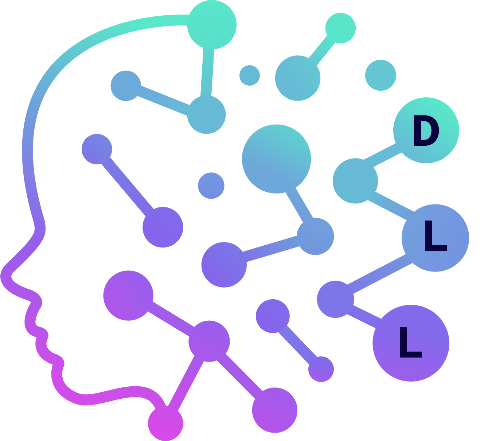

## Deep Learning Lab IIITA - Official Website

<!--  -->

## Project Overview

This repository contains the official website for the Deep Learning Lab at IIIT Allahabad. The website serves as a central platform for showcasing the lab's research, publications, projects, team members, and opportunities for internships and courses.

## Features

- **Modern Responsive UI**: Built using React and Material UI with a clean, professional design
- **Content Management System**: Secure admin dashboard for managing all website content
- **Dynamic Content Sections**:
  - Publications
  - Projects
  - Internships
  - Courses
  - Team members
  - Gallery
- **Authentication System**: Secure login and access control for administrators
- **Responsive Design**: Optimized for all device sizes

## Tech Stack

### Frontend
- React 19
- Material UI 7
- React Router 7
- Axios for API requests
- Vite as the build tool

### Backend
- Node.js with Express
- MongoDB with Mongoose for database operations
- JWT for authentication
- bcrypt.js for password security

## Project Structure

```
/
├── client/                # Frontend application
│   ├── public/            # Static files
│   └── src/               # React source code
│       ├── components/    # Reusable components
│       │   ├── admin/     # Admin dashboard components
│       │   ├── common/    # Shared components
│       │   └── layout/    # Layout components
│       ├── pages/         # Page components
│       └── styles/        # Global styles
│
└── server/                # Backend application
    ├── config/            # Configuration files
    ├── controllers/       # API controllers
    ├── middleware/        # Express middleware
    └── models/            # Database models
```

## Installation & Setup

### Prerequisites
- Node.js (v16+)
- MongoDB
- npm or yarn

### Backend Setup
1. Navigate to the server directory:
   ```
   cd server
   ```
2. Install dependencies:
   ```
   npm install
   ```
3. Create a `.env` file with the following variables:
   ```
   PORT=5000
   MONGO_URI=your_mongodb_connection_string
   JWT_SECRET=your_jwt_secret
   REGISTRATION_CODE=your_secure_code_for_admin_registration
   ```
4. Start the server:
   ```
   npm run dev
   ```

### Frontend Setup
1. Navigate to the client directory:
   ```
   cd client
   ```
2. Install dependencies:
   ```
   npm install
   ```
3. Create a `.env` file with the following variable:
   ```
   VITE_API_URL=http://localhost:5000
   ```
4. Start the development server:
   ```
   npm run dev
   ```

## Usage

### Admin Dashboard
1. Register as an admin using the secure registration code
2. Log in to access the admin dashboard
3. Manage content through the intuitive interface
4. Update your admin account credentials as needed

### Content Management
The admin dashboard allows administrators to:
- Add, edit, and delete publications
- Manage ongoing and completed projects
- Post and update internship opportunities
- Add and modify course information
- Update team member profiles
- Manage gallery content

## Deployment

### Frontend Deployment
1. Build the frontend:
   ```
   cd client
   npm run build
   ```
2. Deploy the contents of the `dist` directory to a static hosting service

### Backend Deployment
1. Set up environment variables on your hosting platform
2. Deploy the server code to a Node.js hosting service

## API Endpoints

### Authentication
- `POST /api/admin/register`: Register a new admin
- `POST /api/admin/login`: Login as an admin
- `PUT /api/admin/update-credentials`: Update admin credentials

### Publications
- `GET /api/publications`: Get all publications
- `POST /api/publications`: Add a new publication
- `PUT /api/publications/:id`: Update a publication
- `DELETE /api/publications/:id`: Delete a publication

### Projects
- `GET /api/projects`: Get all projects
- `POST /api/projects`: Add a new project
- `PUT /api/projects/:id`: Update a project
- `DELETE /api/projects/:id`: Delete a project

### Internships
- `GET /api/internships`: Get all internships
- `POST /api/internships`: Add a new internship
- `PUT /api/internships/:id`: Update an internship
- `DELETE /api/internships/:id`: Delete an internship

### Courses
- `GET /api/courses`: Get all courses
- `POST /api/courses`: Add a new course
- `PUT /api/courses/:id`: Update a course
- `DELETE /api/courses/:id`: Delete a course

### Team
- `GET /api/team`: Get all team members
- `POST /api/team`: Add a new team member
- `PUT /api/team/:id`: Update a team member
- `DELETE /api/team/:id`: Delete a team member

### Gallery
- `GET /api/gallery`: Get all gallery items
- `POST /api/gallery`: Add a new gallery item
- `PUT /api/gallery/:id`: Update a gallery item
- `DELETE /api/gallery/:id`: Delete a gallery item

## Contributing

We welcome contributions to improve the website. Please follow these steps to contribute:

1. Fork the repository
2. Create a new branch (`git checkout -b feature/your-feature-name`)
3. Make your changes
4. Commit your changes (`git commit -m 'Add some feature'`)
5. Push to the branch (`git push origin feature/your-feature-name`)
6. Open a Pull Request

## Contributors

This project was developed by:

- **Nikhil Ratoliya** - Developer ([GitHub Profile](https://github.com/Nikhilratoliya6))
- **Kushal Bansal** - Developer ([GitHub Profile](https://github.com/kushal7201))

- **Deep Learning Lab Team** - _Content and Requirements_

## License

This project is licensed under the MIT License - see the [LICENSE](LICENSE) file for details.

## Acknowledgments

- Indian Institute of Information Technology, Allahabad
- The Deep Learning Lab faculty and researchers
- All the open-source libraries and frameworks used in this project

---

© 2025 Deep Learning Lab, IIIT Allahabad. All Rights Reserved.
